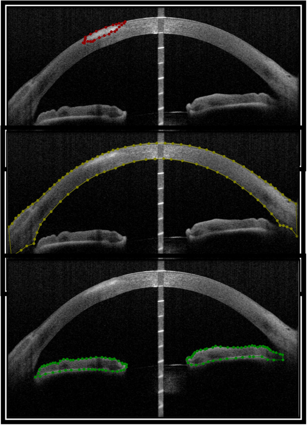
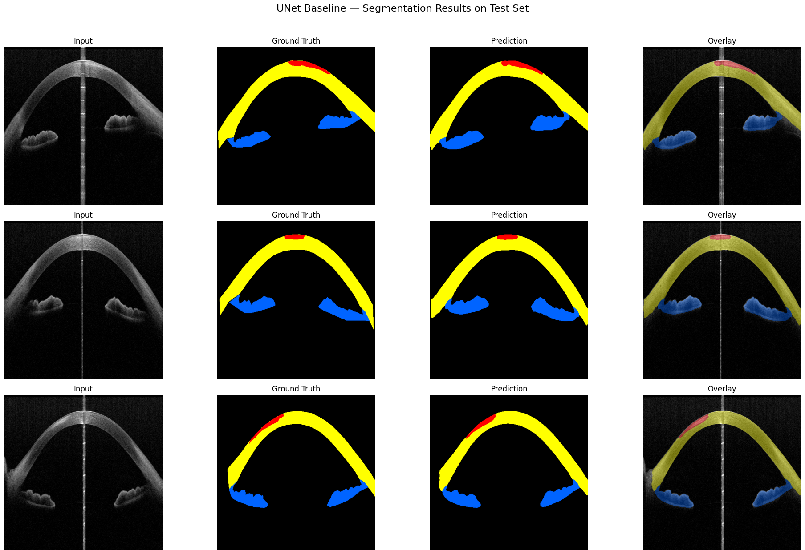
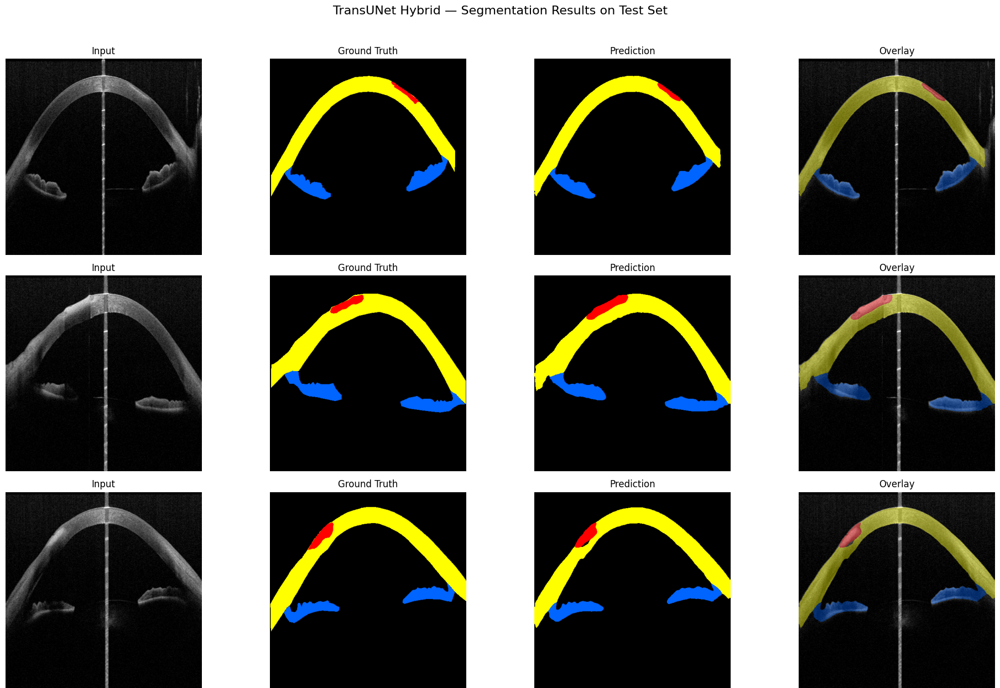

# Automated Segmentation of Corneal Structures and Keratitis Lesions in AS-OCT Images

GitHub repository:  
<https://github.com/officialianxlee/Automated-Segmentation-of-Corneal-Structures-and-Keratitis-Lesions-in-AS-OCT-Images>

This project provides a reproducible three-model benchmark for semantic segmentation of cornea, keratitis lesion, and iris in anterior segment OCT (AS-OCT) images using the public AIDK dataset.

## Project Summary

- **Task:** Multi-class segmentation in keratitis AS-OCT B-scans.
- **Dataset:** AIDK (AS-OCT Image Dataset for Keratitis), 1,168 images from 64 patients.
- **Main finding:** Three architecturally different models converge to similar lesion Dice scores (~0.66-0.67), suggesting the current performance ceiling is data-limited more than architecture-limited.
- **Models included in this repo:**
  - ScLNet adaptation
  - ResNet-34 UNet baseline
  - TransUNet hybrid

## Repository Layout

```text
.
|-- Models/
|   |-- oct-image-segmentation.ipynb
|   |-- oct-image-segmentation-unet.ipynb
|   `-- transunethybrid.ipynb
|-- Figures/
|   |-- aidk_example.jpg
|   |-- sclnetoutput.png
|   |-- baseunetoutput.png
|   `-- transunetoutput.png
`-- README.md
```

## Notebook Guide

| Notebook | Model | Purpose | Key Output Files |
|---|---|---|---|
| `Models/oct-image-segmentation.ipynb` | ScLNet (adapted) | Boundary-aware multi-task architecture adapted from corneal OCT segmentation | `sclnet_keratitis_best.pth`, `sclnet_keratitis_checkpoint.pth` |
| `Models/oct-image-segmentation-unet.ipynb` | ResNet-34 UNet baseline | Controlled baseline for fair architectural comparison | `unet_baseline_best.pth`, `unet_baseline_checkpoint.pth` |
| `Models/transunethybrid.ipynb` | TransUNet hybrid | ResNet encoder + transformer bottleneck + deep supervision + lesion-focused Focal Tversky loss | `transunet_hybrid_best.pth`, `transunet_hybrid_history.json`, `transunet_hybrid_curves.png` |

## Benchmark Snapshot (Test Set)

| Model | Lesion DSC | Lesion IoU | Lesion Precision | Lesion HD (px) |
|---|---:|---:|---:|---:|
| ScLNet | 0.6713 | 0.6068 | 0.6788 | 7.30 |
| ResNet-34 UNet | 0.6686 | 0.6029 | 0.6791 | 7.96* |
| TransUNet Hybrid | 0.6585 | 0.5870 | 0.6241 | 8.19* |

\* HD averaged on 76/77 test images (1 image had empty lesion prediction).

## Visual Examples

### Example AS-OCT Input



### Qualitative Model Outputs

| ScLNet | ResNet-34 UNet | TransUNet Hybrid |
|---|---|---|
|  |  |  |

## Setup

### 1. Clone

```bash
git clone https://github.com/officialianxlee/Automated-Segmentation-of-Corneal-Structures-and-Keratitis-Lesions-in-AS-OCT-Images.git
cd Automated-Segmentation-of-Corneal-Structures-and-Keratitis-Lesions-in-AS-OCT-Images
```

### 2. Create environment

```bash
python3 -m venv .venv
source .venv/bin/activate
python -m pip install --upgrade pip
```

### 3. Install dependencies

```bash
# Choose a PyTorch build matching your CUDA/CPU environment.
pip install torch torchvision torchaudio --index-url https://download.pytorch.org/whl/cu118
pip install albumentations opencv-python-headless scikit-learn scipy matplotlib tqdm jupyterlab pillow
```

## Dataset Preparation

This repo does **not** include the AIDK dataset. Download/extract it separately and point each notebook to your local dataset root.

Expected folder structure:

```text
AIDK_Dataset/
|-- Partial-frame_Dataset/
|   |-- Original_AS-OCT_Images/   # 1.bmp ... 400.bmp
|   `-- Experts_Annotations/      # 1.json ... 400.json
`-- Full-frame_Dataset/
    |-- Original_AS-OCT_Images/   # 1.bmp ... 768.bmp
    `-- Experts_Annotations/      # 1.json ... 768.json
```

## How To Run

1. Launch Jupyter:

```bash
jupyter lab
```

2. Open one of the three notebooks in `Models/`.
3. In the **Configuration** section (`## 1 - Configuration`), set:
   - `DATASET_ROOT` to your local AIDK dataset path
   - `USE_SUBSET` (`"partial"`, `"full"`, or `"both"`)
   - `INCLUDE_IRIS` (`True` or `False`)
4. Run cells top-to-bottom.

Recommended setting to reproduce the three-model comparison:

```python
USE_SUBSET = "full"
INCLUDE_IRIS = True
```

Recommended setting for maximum lesion patient diversity:

```python
USE_SUBSET = "both"
INCLUDE_IRIS = False
```

## Important Notebook Notes

- The notebooks use fixed seed `SEED = 42` and matched train/val/test splitting logic for controlled comparison.
- GPU execution is strongly recommended for practical training time.

## Reproducibility Checklist

- Same random seed (`42`)
- Same image size (`512 x 512`)
- Same train/val/test split policy (70/20/10 from full-frame setting)
- Same optimizer schedule family (SGD + StepLR) across the three benchmark runs
- Consistent metric reporting (DSC, IoU, MCC, Precision, Hausdorff Distance)

## Citation

If you use this repository, please cite the AIDK dataset paper and this repository.

```bibtex
@misc{lee2026keratitis_segmentation_repo,
  author       = {Ian Lee},
  title        = {Automated Segmentation of Corneal Structures and Keratitis Lesions in AS-OCT Images},
  year         = {2026},
  howpublished = {\url{https://github.com/officialianxlee/Automated-Segmentation-of-Corneal-Structures-and-Keratitis-Lesions-in-AS-OCT-Images}}
}
```

## Acknowledgments

- AIDK dataset: Sun et al., 2024
- ScLNet architecture inspiration: Cao et al., 2024
- TransUNet concept: Chen et al., 2021

